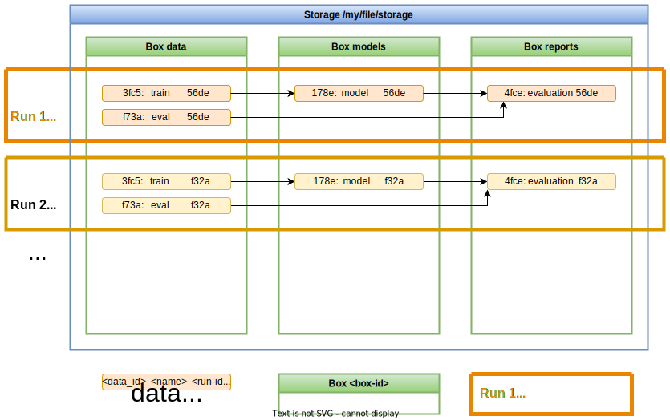

# User guide

This user guide can be used as a starting point for getting a deeper understanding of
the inner workings of the boxs library. It is meant for users who want to learn
about individual details or who plan to extend its features by developing own
value types or transformers.

## Data organization

Boxs keeps track of data items and their dependencies that are created when executing
python code. Data items are identified by some automatic derived `data_id`, but for
easier usage user-defined unique names within a single run are supported, too.
Each execution leads to a new set of data items without overwriting anything. This
allows to compare them across different "runs". All data items are organized in
"Boxes", that can be used for grouping together related items. Multiple Boxes can share
a single Storage, which actually stores the data and their meta-data.



Each individual data item can be referenced by 3 different ids:

- box_id: The id of the box, in which the data item is stored.
- data_id: The id identifying the same data entity across multiple runs.
- run_id: The id that identifies the run in which this data item was created.

!!! warning
    Boxs treats all data as immutable. Once written, a data item can't be updated.
    Instead a new data item with a different run_id should be used. Even though
    deleting a run and reusing its `run_id` is possible, it is HIGHLY discouraged
    since doing so can lead to inconsistencies especially with dependency tracking
    across different runs.

## User API

`Boxs` user API can be imported from the `boxs` package. All classes and functions that
are meant for users, are importable from the top level package.

### store()

[`boxs.store()`](../api/#boxs.api.store)
is the function that stores an actual value. It takes a couple of
arguments, that influence where the data is stored, how the value is serialized, how
its data id is calculated and what additional meta-data should be stored along with
it.

The full signature of the method looks like this:

```python
def store(
    value,
    *parents,
    name=None,
    origin=ORIGIN_FROM_FUNCTION_NAME,
    tags=None,
    meta=None,
    value_type=None,
    run_id=None,
    box=None
) -> boxs.DataInfo:
```
The function returns an object of type [`boxs.DataInfo`](../api/#boxs.data.DataInfo).
This type contains a reference to the stored data, which allows to load it again at a
later time, and some additional meta information about it, including how it was stored.

`store()` arguments are described as follows:

#### value

`value` contains the data that should be stored. Out of the box, boxs supports natively
a couple of different types that can be stored:

- [String](../api/#boxs.value_types.StringValueType)
- [Bytes/Bytebuffer](../api/#boxs.value_types.BytesValueType)
- [Stream](../api/#boxs.value_types.StreamValueType)
- [Files](../api/#boxs.value_types.FileValueType) or
  [directories](../api/#boxs.value_types.DirectoryValueType) in form of `pathlib.Path`

With some limitation it can store `list`s and `dict`s, too, as long as every contained
value can be serialized to JSON without the need of a custom
[JSONEncoder](https://docs.python.org/3/library/json.html#json.JSONEncoder).

All other types of values can be stored either by explicitly setting the `value_type`
argument or adding one that supports this type to the box which will contain the value.

#### *parents

Boxs supports tracking dependencies between different values. This can be helpful e.g.
when trying to understand the impact of changes in complex situations or when data is
reused from different runs.
Adding already stored data items as parents to a new data item is done by providing
them as additional positional arguments to the `store()` call, e.g.:

```python
import boxs

...

def fetch_data():
    ...
    data = boxs.store(data_values, box='my-box-id', name='data')
    return data

def partition_data(data):
    ...
    train_data = boxs.store(train_values, data, box='my-box-id', name='train_data')
    eval_data = boxs.store(eval_value, data, box='my-box-id', name='eval_data')
    return train_data, eval_data

...

data = fetch_data()
train_data, eval_data = partition_data(data)
```

In this example the second function `partition_data(data)` stores two new data items
`train_data` and `eval_data` using `data` as a parent data item.

#### origin=ORIGIN_FROM_FUNCTION_NAME,

Stored data items are referenced by a data_id, that is automatically derived from the
origin of the data, defined by this keyword argument, and their parents. The origin is
meant to describe in textual fashion, where some data originated. Its argument value
can be either a `str`, or a `Callable` that returns a string. As a default, a callable
is used, that extracts the name of the function from the stack, where `store()` is
called from.

The callable can optionally take a [`OriginContext`](../api/#boxs.origin.OriginContext)
object, from whose attributes the origin can be constructed. For more information take a
look at the type of the [`OriginMappingFunction`](../api/#boxs.origin.OriginMappingFunction).

#### name=None

Referencing all data just from its automatically generated `data_id` is not the most
convenient way for users. With every new dependency or some changes to the origin the
data id changes to something completely different, so it becomes hard to keep track of
things. To alleviate this, data items can be named by providing a value for the `name`
keyword argument when storing the data. These names have to be unique within a run and
can be used to refer to a specific data item from the command line. As a default, no
names are given.

#### tags=None

Often it can be helpful to group data items by some criteria. This is why one can
assign a set of tags to each data item when storing new data. These tags are mappings
from string keys to string values. The tags can later be used for listing data items
or determine how they should be handled. As a default, no tags are used.

#### meta=None

The `meta` keyword argument is meant for storing arbitrary meta-data about the item
that might be useful later. This can be things like information about the size or
source of data, e.g. a date which tells the update date of its data source. In general,
all keys in `meta` must be strings. The values can differ, though. It can be any of
the types that are supported by the python JSON encoder, so even dicts and lists can be
used, as long as all values they contain can be serialized to JSON.

Boxs uses the same meta-data internally, for keeping track of the type of the value as
well as some useful information like checksums or size of the data. So when inspecting
the `meta` attribute of a data item, not only user-defined meta-data is shown.

#### value_type=None

[`ValueType`s](../api/#boxs.value_types.ValueType)
are the mechanism that allows to store values in the first place. In
order to know, how to serialize and deserialize a specific value, boxs needs a
corresponding value type. For a set of common used types, boxs has a predefined list
of value types that are used, e.g. for files, strings, bytes or stream, so the
value_type argument doesn't need to be set and can stay on its default `None`. For
custom types though, a `value_type` has to be provided.

#### run_id=None

Boxs automatically generates a new `run_id` every time, it is run in a new process.
This `run_id` allows to correlate the version of a specific data item to a single
invocation of the script, that created the data. There might be situations, where the
user wants to override this automatic mechanism and do a manual run_id management. In
this case, providing a custom `run_id` will override the automatically generated one.

#### box=None
Boxs organizes data in collections, called "boxes". This keyword argument can be used
for specifying, in which box the data should be stored. Its value can be either a
`str` with the `box_id` of the box, or the `Box` object itself. If no `box` is
specified, the [`default_box`](../api/#boxs.config.Configuration.default_box) from
the configuration is used. Since a box is required, a ValueError is raised, if no box
is specified neither as keyword argument nor in the configuration.

### load()

Once a value has been stored, the question is now, how to load it once we need to use
it again. For this boxs provides a [`boxs.load()`](../api/#boxs.api.load) function,
that takes a reference to the data item and returns the stored value, that can be of
any type.

```python

def load(data, value_type=None) -> Any:
```

#### data

The data item whose value should be loaded. `data` can be of the two types,
either [boxs.data.DataInfo](../api/#boxs.data.DataInfo) or
[boxs.data.DataRef](../api/#boxs.data.DataRef).
`DataInfo` is the type returned by the `store()` method. It contains information about
the data item, how it was stored and its ancestors. In contrast, `DataRef` contains
only the necessary ids for uniquely identifying a data item.

Both, `DataInfo` and `DataRef` provide a `load()` method just for convenience, that
internally use the`boxs.load()` function.

#### value_type=None

The [`ValueType`](../api/#boxs.value_types.ValueType)
to use for converting the stored data to a python value. Usually, this
doesn't need to be provided and can be left as its default `None`, since when storing
of a value, the used value_type is added to the meta-data of the item, so that the same
value_type can be reused, when the value is loaded again.
Sometimes though, a user wants to use a different value type when loading data. In
this case the `value_type` provided explicitly when calling `load()` can override the
value type that is stored with the value.

### info()

`info()` returns the `DataInfo` about a data item from its `DataRef` reference.
This function is usually not called directly, because it is more convenient to use the
corresponding property [`DataRef.info`](../api/#boxs.data.DataRef.info) that uses the
`info()` function internally.


## ValueType

Within a python script different types of data are used. In order to know, how these
different values can be stored and loaded, boxs uses the concept of
[`ValueType`s](../api/#boxs.value_types.ValueType).
A value type corresponds usually to one specific python type that it supports.
`ValueType` defines two methods, that are used for actually writing the value
to storage and reading it at a later time:

```python
    @abc.abstractmethod
    def write_value_to_writer(self, value, writer):
        raise NotImplementedError

    @abc.abstractmethod
    def read_value_from_reader(self, reader):
        raise NotImplementedError
```

[`ValueType.write_value_to_writer(value, writer)`](../api/#boxs.value_types.ValueType.write_value_to_writer)
takes two arguments, value and writer. `value` is the value, that should be stored.
The `writer` argument points to a storage specific implementation of the
[`Writer`](../api/#boxs.storage.Writer) interface, that allows to write data and the
additional infos to the storage.


[`ValueType.read_value_from_reader(reader)`](../api/#boxs.value_types.ValueType.read_value_from_reader)
takes only a single argument. `reader` contains a storage specific implementation of the
[`Reader`](../api/#boxs.storage.Reader) interface, that allows to read data or infos
back from storage.


Each `Box` contains a pre-defined list of value types for common types like strings,
bytes or files and directories. These value types are automatically used depending on
the type of `value`. This works by them implementing another method of the `ValueType`
interface, [`supports(value)`](../api/#boxs.value_types.ValueType.supports):

```python
    def supports(self, value):
        return False
```

This method is given a value that should be stored and returns, if it supports writing
this value or not. When a box should store a value without an explicit defined value
type, it loops through its list of default types and uses the first type that returns
`True` when its `supports(value)` method is called.

`ValueType` defines two additional methods, that are used for recreating a value that
has been stored before.
When a value has been stored, boxs calls the
[`get_specification()`](../api/#boxs.value_types.ValueType.get_specification)
method of the used value type, which returns a string specification of the value type.
This specification is then added as an additional field 'value_type' to the meta-data.
Once this value should be loaded, the corresponding value type is recreated using the
class method
[`from_specification(cls, specification)`](../api/#boxs.value_types.ValueType.from_specification)
which takes the specification string
from the meta-data and returns a ValueType instance that is then used for reading the
value.

## Box

A [`Box`](../api/#boxs.box.Box) is the class that actually implements the logic of storing and loading of
values. Its interface matches the free functions `store()`, `load()` and `info()`
from the boxs package once created:

- [`store()`](../api/#boxs.box.Box.store) see [`boxs.store()`](../api/#boxs.api.store) for a description
- [`load()`](../api/#boxs.box.Box.load) see [`boxs.load()`](../api/#boxs.api.load) for a description
- [`info()`](../api/#boxs.box.Box.info) see [`boxs.info()`](../api/#boxs.api.info) for a description

Before a box can be used, it needs to be defined. This is done by creating a new
instance of its class:

```python
import boxs

...
box = boxs.Box('my-box-id', storage)
```
Its constructor takes a string containing the `box_id` and the underlying storage
object, that actually stores the data of the items stored in the box.

When a Box is created, it registers itself with its `box_id`. This allows to find the
box by its id at a later time, using the
[`get_box(box_id)`](../api/#boxs.box_registry.get_box) function.

A box comes with a pre-defined list of value types to support storing a some common
types. Additional `ValueType` can be added by its
[`add_value_type(value_type)`](../api/#boxs.box.Box.add_value_type) method.
This method adds the new value type at the
beginning of the list, so that it takes precedence before the standard types.

## Storage

[`Storage`](../api/#boxs.storage.Storage) is the interface that defines what methods
storage implementations have to implement and adhere to, to be used by `boxs` for
storing and loading data.

### Reading and writing items

A `Storage` implementation provides the means to read and write data items by
creating new storage specific readers and writers for each data item that should be
stored or loaded. Responsible for this are the two methods
[`create_reader(item)`](../api/#boxs.storage.Storage.create_reader)
and [`create_writer(item, name, tags)`](../api/#boxs.storage.Storage.create_writer)
of the Storage interface.

In both cases the argument `item` is of type
[`boxs.storage.Item`](../api/#boxs.storage.Item)
which contains the ids of the item to be read or written.

```python

    @abc.abstractmethod
    def create_reader(self, item):
        """
        Returns:
            boxs.storage.Reader: The reader that will load the data from the
                storage.
        """

    @abc.abstractmethod
    def create_writer(self, item, name=None, tags=None):
        """
        Returns:
            boxs.storage.Writer: The writer that will write the data into the
                storage.
        """
```

#### Writer

A `Writer` implementation has to inherit from the
[`boxs.storage.Writer`](../api/#boxs.storage.Writer) base class.
The base class defines a set of properties and methods that are used within boxs to
write data items. When implementing the interface, only 2 methods are needed:

```python
    @abc.abstractmethod
    def as_stream(self):
        """
        Return a stream to which the data content should be written.

        Returns:
            io.RawIOBase: The binary io-stream.
        """

    @abc.abstractmethod
    def write_info(self, info):
        """
        Write the info for the data item to the storage.

        Args:
            info (Dict[str,Any]): The information about the new data item.
        """
```

[`as_stream()`](../api/#boxs.storage.Writer.as_stream) is used by the individual value
types to transfer the actual data of the values that should be stored. The
implementation has to return a binary stream, that is not already opened.

The second method [`write_info(info)`](../api/#boxs.storage.Writer.write_info)
is called by boxs, once the data has been written. It takes a single dictionary as
argument, that contains information describing the data item. The Writer
implementation shouldn't expect anything about the format of the dictionary. The
only guaranteed property is that it can be serialized using the standard JSON library.

Both methods must raise a
[`boxs.errors.DataCollision`](../api/#boxs.errors.DataCollision)
exception when an item with the same ids already exists. Alternatively, the error
can be raised when the writer is created.

#### Reader

Similar to the `Writer` class, the [`Reader`](../api/#boxs.storage.Reader) class has
the corresponding 2 methods:

```python
    @abc.abstractmethod
    def as_stream(self):
        """
        Return a stream from which the data content can be read.

        Returns:
            io.RawIOBase: A stream instance from which the data can be read.
        """

    @property
    @abc.abstractmethod
    def info(self):
        """Dictionary containing information about the data."""
```

[`as_stream()`](../api/#boxs.storage.Reader.as_stream) is used by the individual value types to read the actual data of the
value that was stored. The implementation has to return a binary stream, that is not
already opened.

[`info`](../api/#boxs.storage.Reader.info) is a property, that returns the info dictionary,
that was previously written. Ideally, the implementation caches the info once it has been read.

Both methods must raise a [`boxs.errors.DataNotFound`](../api/#boxs.errors.DataNotFound)
exception when the item that should be read, doesn't exist. Alternatively, the error
can be raised when the reader is created.

### Querying and manipulating a storage

Besides creating the `Writer` or `Reader`, the `Storage` interface contains additional
methods, that are used for querying or manipulating the stored data items. These
methods are currently only used by the [command-line interface](../cli/).

!!! warning
    The `Storage` interface is not meant to be used directly by the user, but
    should be regarded as an implementation detail of `boxs` whose interface might
    change between versions. This does NOT include the interfaces `Writer` and
    `Reader` which have to be used by `ValueType` implementations and therefore
    should be stable.

```python

    @abc.abstractmethod
    def list_runs(self, box_id, limit=None, name_filter=None):
        """
        List the runs within a box stored in this storage.

        The runs should be returned in descending order of their start time.

        Args:
            box_id (str): `box_id` of the box in which to look for runs.
            limit (Optional[int]): Limits the returned runs to maximum `limit` number.
                Defaults to `None` in which case all runs are returned.
            name_filter (Optional[str]): If set, only include runs which have names
                that have the filter as prefix. Defaults to `None` in which case all
                runs are returned.

        Returns:
            List[box.storage.Run]: The runs.
        """

    @abc.abstractmethod
    def list_items(self, item_query):
        """
        List all items that match a given query.

        The item query can contain parts of box id, run id or run name and data id or
        data name. If a query value is not set (`== None`) it is not used as a filter
        criteria.

        Args:
            item_query (boxs.storage.ItemQuery): The query which defines which items
                should be listed.

        Returns:
            List[box.storage.Item]: The runs.
        """

    @abc.abstractmethod
    def set_run_name(self, box_id, run_id, name):
        """
        Set the name of a run.

        The name can be updated and removed by providing `None`.

        Args;
            box_id (str): `box_id` of the box in which the run is stored.
            run_id (str): Run id of the run which should be named.
            name (Optional[str]): New name of the run. If `None`, an existing name
                will be removed.

        Returns:
            box.storage.Run: The run with its new name.
        """

    @abc.abstractmethod
    def delete_run(self, box_id, run_id):
        """
        Delete all the data of the specified run.

        Args;
            box_id (str): `box_id` of the box in which the run is stored.
            run_id (str): Run id of the run which should be deleted.
        """
```


## Transformer

[`Transformers`](../api/#boxs.transform.Transformer) are a mechanism for extending how
data is stored and what meta-data is stored alongside. This works by wrapping the
`Reader` and `Writer` that are created by the `Storage` and returning a different
reader/writer.

Boxs comes with some ready-to-use transformers. The
[`StatisticsTransformer`](../api/#boxs.statistics.StatisticsTransformer)
gathers additional statistics about each data item like the size in bytes or number of
lines. Another built-in transformer is the
[`ChecksumTransformer`](../api/#boxs.checksum.ChecksumTransformer)
which calculates checksums when storing data and verifies the checksum when that data
is loaded again. This allows to detect transfer errors and can be used later for
de-duplicating the data stored in a storage.

### Using transformers

Enabling transformers is done on a per-box level. A transformer is enabled by adding
it as positional argument to instantiation of the box that should use it:

```python
import boxs

box = boxs.Box(
    'my-box-id',
    boxs.FileSystemStorage('/my/path/to/storage/dir'),
    boxs.StatisticsTransformer(),
    boxs.ChecksumTransformer(),
)
```

### Implementing transformers

The [`Transformer`](../api/#boxs.transform.Transformer)
base class contains only two simple methods:

```python
    def transform_writer(self, writer):
        return writer

    def transform_reader(self, reader):
        return reader
```

[`transform_writer(writer)`](../api/#boxs.transform.Transformer.transform_writer)
takes a `Writer` instance as argument and returns a
new writer. This allows to intercept the write operations and modify the data as it is
written. The writer gives access to the item specific meta-data, too, so that the
transformed writer can add new attributes. The implementation of the base class
returns the same `writer` it gets, so doing nothing.

[`transform_reader(reader)`](../api/#boxs.transform.Transformer.transform_writer)
works in the same way. It receives a `Reader` instance
that can be wrapped with an own implementation that modifies the data as it is being
read. Modifying meta-data can be done, too, but is not recommended, since it creates
an inconsistency between the meta-data in the storage, and the one that is seen by the
value type loading the value. The base implementation returns the reader without any
modification.

To make the implementation easier, `boxs.transformer` contains already a reader and a
writer that delegates all its methods to a wrapped reader/writer. These
[`DelegatingReader`](../api/#boxs.transform.DelegatingReader)
and [`DelegatingWriter`](../api/#boxs.transform.DelegatingWriter) classes can be used for implementing
a custom transformer. Similarly, If the data stream should be intercepted, the
[`boxs.io.DelegatingStream`](../api/#boxs.io.DelegatingStream) class can be used for
modifying the `read()` or `write()` operations on the stream.

## Configuration

Even though, boxs tries to minimize the amount of steps necessary to use it, some
aspects of it can be configured. For this it uses internally a configuration, that
is returned from its [`get_config()`](../api/#boxs.config.get_config) function. The
configuration is automatically created on first use.

### Configurable values

#### default_box

One configuration value that can be set is the
[`default_box`](../api/#boxs.config.Configuration.default_box). This value is a
string, that contains the `box_id` of the box that should be used, if no box is
explicitly specified.
The value can be either set directly

```python
import boxs

config = boxs.get_config()
config.default_box = 'my-default-box'
```

or as part of the environment by specifying the environment variable
`BOXS_DEFAULT_BOX`.

#### init_module

The value ['init_module'](../api/#boxs.config.Configuration.init_module) contains the
module name of python module, that should be automatically imported once boxs has been
initialized. This allows to make sure that a specific box has been defined before the
code using it is executed.

The value can be either set directly

```python
import boxs

config = boxs.get_config()
config.init_module = 'my_box_init'
```

or as part of the environment by specifying the environment variable
`BOXS_INIT_MODULE`.

!!! warning
    Setting this value at run-time will lead to the module getting imported if it
    hasn't been loaded yet. Be careful about circular dependencies between this module
    and boxs.


## How to use boxs

Now with some knowledge about the different concepts within boxs at our hands, let's
dive into the topic of how to put the library to good use.

### Install the library

#### Use stable release from PyPI

All stable versions of bandsaw are available on [PyPI](https://pypi.org/project/boxs/)
and can be downloaded and installed from there. The easiest option to get it installed
into your python environment is by using `pip`:

```bash
pip install boxs
```

#### Use from source

[Boxs's Git repository](https://gitlab.com/kantai/boxs/-/tree/mainline) is available
for everyone and can easily be cloned into a new repository on your local machine:

```bash
$ cd /your/local/directory
$ git clone https://gitlab.com/kantai/boxs.git
$ cd boxs
```

If you want to make changes to library, please follow the guidance in the
[README.md](https://gitlab.com/kantai/boxs/-/blob/mainline/README.md) on how
to setup the necessary tools for testing your changes.

If you just want to use the library, it is sufficient to add the path to your local
boxs repository to your `$PYTHONPATH` variable, e.g.:

```bash
$ export PYTHONPATH="$PYTHONPATH:/your/local/directory/boxs"
```
